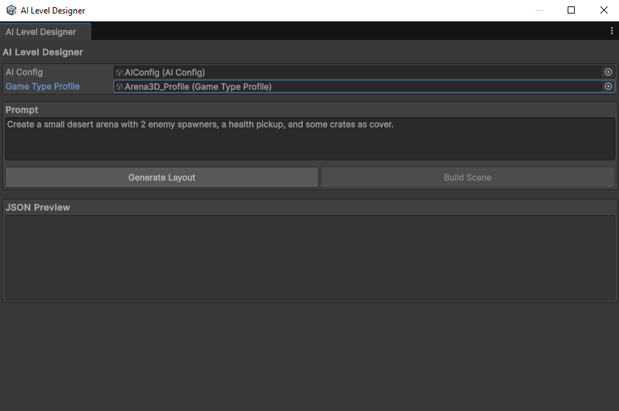
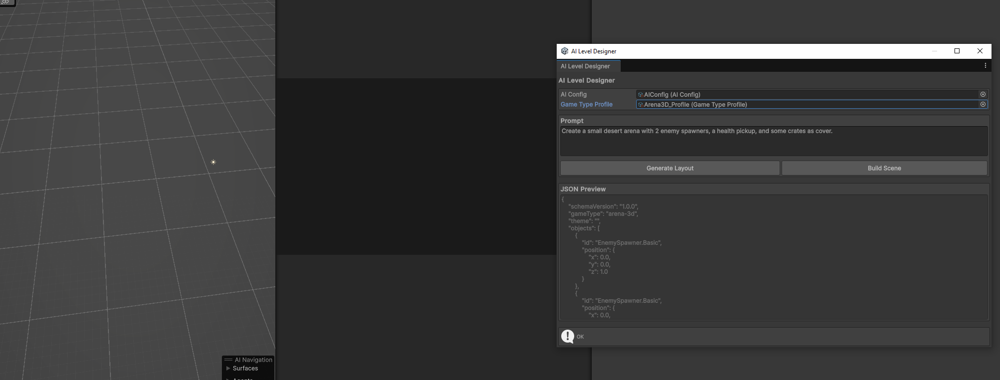
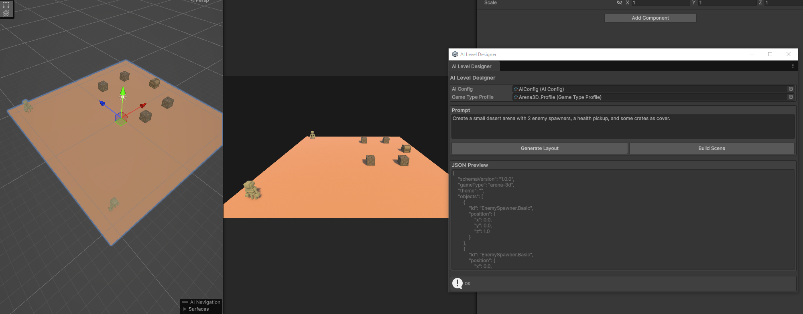
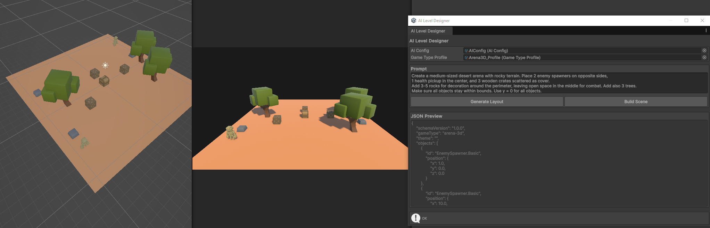
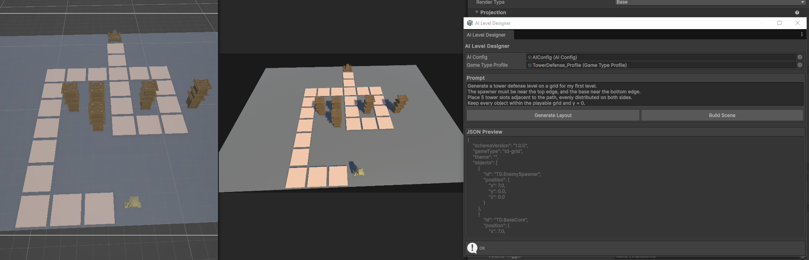

# AI Level Designer

[](https://unity.com/)
[](https://learn.microsoft.com/en-us/dotnet/csharp/)
[](LICENSE)
[](https://ollama.ai/)
[]()

A Unity Editor extension that automatically generates playable level layouts using AI.  
It integrates with **OpenAI** or **Ollama** to produce JSON-based scene blueprints that are built directly into the Unity editor.

---

## Overview

**AI Level Designer** provides a complete workflow for procedural level creation assisted by AI.  
It supports multiple game types such as *3D Arenas* and *Tower Defense Grids*, and includes schema validation, catalog limits, and in-editor visualization.

### Features
- **AI-driven layout generation** (via OpenAI or Ollama)
- **Automatic scene construction** from generated JSON
- **Schema validation and catalog constraints**
- **Grid and world coordinate modes**
- **Support for multiple game profiles**
- **Progress indicator and safe async execution inside Editor**
- **Compact, maintainable C# runtime and editor codebase**

---

## Screenshots

| Base Window | Arena Generation | Arena Built | Tower Defense Generation | Tower Defense Built |
|--------------|-----------------|--------------|---------------------------|----------------------|
|  |  |  |  |  |

---

## How It Works

1. **Prompt Input**  
   Write a natural language prompt describing the level you want (e.g., “Create a desert arena with obstacles and two enemy spawners”).

2. **AI Generation**  
   The plugin sends your prompt and profile configuration to an AI backend (OpenAI API or Ollama local model).  
   The response must follow the internal JSON schema `layout_v1`.

3. **Layout Validation**  
   The result is automatically validated against the game’s catalog and adjusted (e.g., max object caps).

4. **Scene Build**  
   A Unity scene is built automatically from the generated layout, spawning all prefabs in their correct positions.

---

## Installation

1. Clone this repository:
   ```bash
   git clone https://github.com/yourusername/AILevelDesigner.git
  ``

2. Copy the folder into your Unity project’s `Assets/` directory.
3. Ensure the following folders exist:

   ```
   Assets/AILevelDesigner/
   ├── Editor/
   ├── Building/
   ├── Configs/
   ├── Profiles/
   ├── Resources/AILevelDesigner/Schemas/
   └── Screenshots/
   ```
4. Add your **OpenAI API Key** or local **Ollama endpoint** in `AIConfig`.

---

## Usage

1. Open the editor window from **Tools → AI Level Designer**
2. Select:

   * **AI Config:** your configuration asset
   * **Game Type Profile:** either `Arena3D_Profile` or `TowerDefense_Profile`
3. Write a natural language prompt.
4. Click **Generate Layout**.
   A progress bar will appear while the request is processed.
5. Click **Build Scene** to instantiate the generated layout.

---

## Example Prompts

### Arena 3D

```
Create a medium-sized desert arena with rocky terrain.
Place 2 enemy spawners on opposite sides, 1 health pickup in the center, and 3 crates as cover.
Add 3 trees for decoration, keeping the middle area open for combat.
All objects should stay within bounds, using y=0 for placement.
```

### Tower Defense (Grid)

```
Generate a tower defense level on a 12x8 grid.
The spawner must be near the top edge, and the base core near the bottom.
Draw a winding S-shaped path connecting them.
Place 6–8 tower slots adjacent to the path on both sides, and 2 decorations away from it.
Keep all elements aligned to the grid and y=0.
```

---

## Configuration

### AIConfig

* **openAIModel:** model name (e.g., `gpt-4o-mini`, `llama3.1:latest`)
* **endpoint:** API endpoint (OpenAI or Ollama)
* **apiKey:** stored as an environment variable or inside the asset
* **systemPromptHint:** optional hints appended to schema prompts

### GameTypeProfile

* Defines coordinate space (`Grid` or `World`)
* Sets cell size, arena bounds, and prefab catalog
* Includes max-per-level constraints for object types

---

## Architecture

**Core Runtime**

* `LayoutData`, `LayoutObject`: define the schema
* `SceneBuilder`: instantiates prefabs according to profile
* `LayoutSanitizer`: prunes or caps AI output to match catalog
* `Validation/LayoutValidator`: ensures structure integrity

**AI Backends**

* `OpenAIClient`: integrates with OpenAI Responses API
* `OllamaClient`: integrates with local Ollama models

**Editor Layer**

* `AILevelDesignerWindow`: main Unity Editor UI
* Handles async generation, progress feedback, JSON preview, and scene creation.

---

## License

This project is released under the **MIT License**.
You’re free to use, modify, and distribute it with attribution.

---

## Author

Developed by **Lautaro Bravo de la Serna**
[Portfolio](https://lautarobravo.com) · [GitHub](https://github.com/TaaroBravo) · [Codearte](https://codearte.com.ar)

---

### Future Improvements

* Add multi-step refinement (AI → Validation → Rebuild)
* Support for terrain-aware height placement
* Expand prompt templates per game type
* Save/load generated layouts as reusable presets

```
